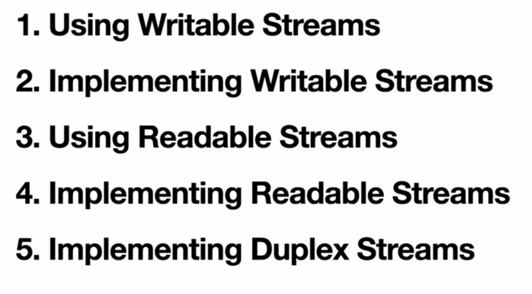

[^goToTop]
[Video Link](https://www.youtube.com/watch?v=e5E8HHEYRNI&t=3984s)

[^@1] 
[^@1]:Writable_Streams ➡️
####  Writable_Streams 
 ➡️

##### 



```
buffers are core of the streams.

create a file and write something to that file

```
```ts

// for bench mark

console.time("text")
console.timeEnd("text")
```

```ts
➡️ // Promise Version
const fs = require('node:fs/promises');
/*
Execution time : 8s 💲 
CPU uses : 100% (one core)
memory usage: 50MB
*/
(async() => {
    console.time('writeMany')
    const fileHandle = fs.open("test.txt", "w")
    for(let i = 0 ; i< 1000000; i++){
        await fileHandle.write(`${i}`) // ➡️ output is ordered
    }
    console.timeEnd('writeMany')
})

```

>- 8 seconds to run

```
nodejs is single threaded and it use one core .. if we
want to use multiple core .. we need to use clustering 
and worker thread

```

> ➡️ call back version in node is little bit faster

```ts
➡️ // callback version 🔵
const fs = require('node:fs');
/*
Execution time : 2s 🚀
CPU uses : 100% (one core)
memory usage: 50MB
*/
(async() => {
    console.time('writeMany')
    const fileHandle = fs.open("test.txt", "w", (err, fileDescriptor) => {

        // file descriptor is just an unique number

        // and to write to it

        for(let i = 0 ; i< 1000000; i++){
            /*
            fs.write(fd, `${i}`) // we are gonna omit the callback
            // and change the syntax to use the synchronous version
            */

           fs.writeSync(fd, `${i}`)

           //callback version are lot faster 🚀
           /// fs.write(fd, `${i}`, () => {}) //➡️ output is unordered
        }        
    })


    
    console.timeEnd('writeMany')
})

```
> ⏳ 27:09
> 
```ts
➡️ // Steam Version
const fs = require('node:fs/promises');
/*
🚩 🚫 Dont do it this way 
Execution time : 263ms 💲 
CPU uses : 100% (one core)
memory usage: 200 MB
*/
(async() => {
    console.time('writeMany')
    const fileHandle = fs.open("test.txt", "w")

    // create write stream of this file
    const writeStream = fileHandle.createWriteStream();

    // now write to this


    for(let i = 0 ; i< 1000000; i++){

        const buff = Buffer.from(`${i}`, "utf-8");

        steam.write( buff /*our chunk.. it could be buffer or it could be string */)
        
    }
    console.timeEnd('writeMany')
})

```

Stream : an abstract interface for working with streaming data in Node.js

Streaming Data :   Data flowing

Encryption...
> Read the data .. transform it .. write it to the destination .. 

> ➡️ converting the string back to buffer and then we are gonna write that

```ts
➡️ // Lets Fix that memory issue 

const fs = require('node:fs/promises');
/*
 
Execution time : around 300ms 💲 
CPU uses : % (one core)
memory usage: 50 MB
*/
(async() => {
    console.time('writeMany')
    const fileHandle = fs.open("test.txt", "w")

    // create write stream of this file
    const writeStream = fileHandle.createWriteStream();

    // size of our internal buffer
    console.log(stream.writableHighWaterMark)// by default 16kb

    // to see how much of that buffer is filled
    console.log(steam.writableLength)

    // stream.write("this");
    /// before write .. lets create buffer first
    const buff = Buffer.from("string");
    
    stream.write(buff);
    stream.write(buff);
    stream.write(buff);

    console.log(steam.writableLength)

    // fill all my buffer with something
    const buff2 = Buffer.alloc(1242134, "a"); // size, by which i want to fill

    console.log(stream.write(buff2)) // it returns boolean ..
    // if buffer is full then it return false..
    // if false .. then we need to wait for to get emptied
    // otherwise we keep pushing the data without clearing .. 


    // how could we let the stream empty itself
    stream.on("drain", () => {
        // it means internal buffer is now empty .. we are safe to
        // write more
    })

    // now write to this

    

    // for(let i = 0 ; i< 1000000; i++){

    //     const buff = Buffer.from(`${i}`, "utf-8");
    //     /****
    //      * we need to check for this value ..
    //      * if it returns false ..  it means .. we need to stop the
    //      * loop .. and then listen for the drain event.. 
    //      * after the drain event happens ... callback function
    //      * we need to do something to continue on with this loop
    //      * ******/
        
    //     steam.write( buff)
        
    // }

    let i = 0;
    const writeMany = () => {
        while(i < 1000000 ){
            const buff = Buffer.from(`${i}`, "utf-8");

            // this is our last write
            if(i === 999999){
                return stream.end(buff) // it fire 'finish' event
                stream.write(data)// error! as we end .. we cannot write
            }

            // if stream.write return false, stop the loop
            if(!stream.write(buff)){
                break;
            }

            i++;
        }
    }

    writeMany()

    // resume our loop once our stream's internal buffer is empty
    stream.on("drain", () => {
        //we need to stop writing .. we need to wait to internal buffer
        // get emptied

        // here.. we are sure .. our internal buffer is empty

        writeMany()
    })

    stream.on("finish", () => {
        console.timeEnd('writeMany')
        fileHandle.close()   
    })

    
})

```

> ⏳ 1:41:12


>- [x] Duplex (stream that has a writable and readable in it self)
>- [x] Transform

---

[^@2] > ⏳ 1:52:30
[^@2]:Readable_Streams ➡️
####  Readable_Streams 
 ➡️

##### 

```ts 
🚩 🚫 Dont do it this way 
/*
Execution time : s 💲 
CPU uses : % (one core)
memory usage: MB
*/
const fs = require('node:fs/promises')

(() => {

    const fileHandleRead = await fs.open("text.txt", "r");

    const fileHandleWrite = await fs.open("dest.txt", "w");

    const streamRead = fileHandleRead.createReadStream()
    const streamWrite = fileHandleWrite.createWriteStream()


    streamRead.on("data", (chunk) => {
        streamWrite.write(chunk)

        console.log("----------")
        console.log(chunk)
    })
})()
```

> ➡️  Lets Optimize this code ..

```ts
const fs = require('node:fs/promises')

(() => {

    const fileHandleRead = await fs.open("text.txt", "r");

    const fileHandleWrite = await fs.open("dest.txt", "w");

    const streamRead = fileHandleRead.createReadStream()
    const streamWrite = fileHandleWrite.createWriteStream()

    /**
     * lets use that draining .. and try to optimize this code ..
     * **/

    streamRead.on("data", (chunk) => {
        /////streamWrite.write(chunk)
        // this function will return false .. if our buffer is full
        // if it is full we should never ever write this stream again   
        // we should drain this buffer.. then write again 

        if(!streamWrite.write(chunk)){
            streamRead.pause()
        }

        streamWrite.on("drain", () => {
            streamRead.resume()
        })
         

        console.log("----------")
        console.log(chunk)
    })
})()
```

>- [x] CheckBox to Keep Status

---

[^@x] 
[^@x]:TopicName ➡️
####  TopicName 
 ➡️

##### 

```

```
>- [x] CheckBox to Keep Status


[^goToTop]: goToTop