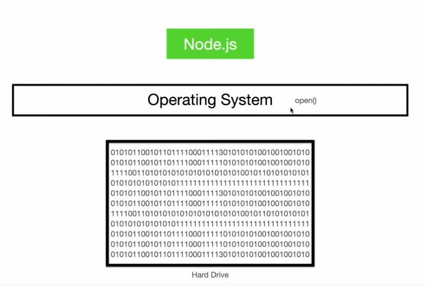

[^goToTop]
[Video Link](https://www.youtube.com/watch?v=e5E8HHEYRNI&t=3984s)

[^@1] 
[^@1]:File_System ➡️
####  File_System 
 ➡️

##### 


```ts

const fs = require('fs');

const content = fs.readFileSync("./text.txt");

console.log("content", content) // return buffer .. 

```

> in node we have buffer to deals with that 0s and 1s

```
With buffer module .. we can 

+ read them 
+ do encoding on it ..
+ convert back to string 
+ convert string to binary 

```

```ts
console.log(content.toString('utf-8'))
/****************

so we can run toString() method on that buffer / on that 
Os and 1s and specify character encoding ..

***************/
```

```
we are running a function in node and nodejs usage libuv

actually calling the open system call to open a file 

```


```
inside libuv there is another concept called thread pool

```

```
3 different ways to do thing ..
1.  Promises API
2.  Callback API
3. Synchronous API 

99% of time stick with Promises API

maximum amount of performance -> Callback API <- very rare cases

Stay away from -> Syncronous API

```


>  31:04 second 
